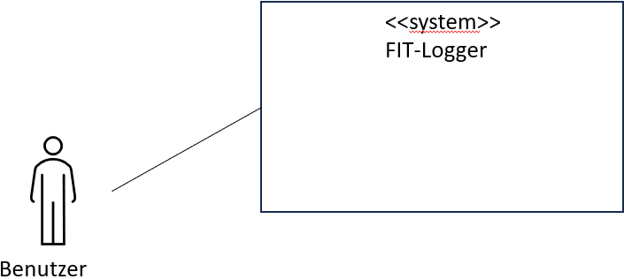

# Inhaltsverzeichnis

1. Einleitung

   - 1.1. Aufgabenstellung
   - 1.2. Motivation und Zielsetzung

2. Randbedingungen

   - 2.1. Technische Randbedingungen
   - 2.2. Organisatorische Randbedingungen

3. Systemkontext
4. Lösungsstrategie
5. Bausteinsicht

   - 5.1 Übersicht
   - 5.2 Bausteine
   - 5.3 Beziehungen und Abhängigkeiten
   - 5.4 Laufzeitperspektive

6. Laufzeitsicht

   - 6.1. Benutzerinteraktion
   - 6.2. AddPage
   - 6.3. Logbuch
   - 6.4. Homeseite
   - 6.5. Produktseite
   - 6.6. Zielseite
   - 6.7. Statistikseite

7. Verteilungssicht

   - 7.1 Übersicht
   - 7.2 Kommunikationsbeziehungen
   - 7.3 Verteilungsdiagramme

8. Datenperspektive

   - 8.1 Übersicht
   - 8.2 Datenstrukturen
   - 8.3 Datenflüsse

9. Infrastruktursicht

   - 9.1 Übersicht
   - 9.2 Technische Umgebung
   - 9.3 Bereitstellung
   - 9.4 Betrieb

10. Konzepte
11. Entwurfsentscheidungen und Technologieeinsatz

- 11.1. Entwickeln einer Progressive Web App
- 11.2. Verwendung des JavaScript-Frameworks "Vue3" zur Entwicklung der PWA
- 11.3. Verwendung des Vue Frameworks Quasar

12. Risiken und technische Schulden
13. Qualitätsziele
14. Glossar

## 1. Einleitung

### 1.1 Aufgabenstellung

#### Was ist der FIT-Logger?

FIT-Logger ist eine Progressive Web App, die es dem Nutzer ermöglicht, seine Ernährung nachzuverfolgen, überwachen und zu planen.

Egal ob man sich bewusster Ernähren möchte, sportliche Ziele verfolgt, oder aufgrund gesundheitlicher Probleme gezwungen ist, seine täglich konsumierten Lebensmittel im Überblick zu behalten: der FIT-Logger ist immer der richtige Begleiter!

#### Wesentliche Features:

- Zieltracking: Visualisierung der Soll und Ist-Werte (Makronährstoffe, Kalorien)
- Festlegung täglicher Kalorien- und Makronährstoffziele
- Verwaltung einer Produkt Datenbank
- Komponieren einer Mahlzeit
- Produktsuche mittels Barcode-Scanner
- Führen eines Ernährungstagebuchs (Logbuch)
- Nachverfolgung festgelegter Ziele: Anzeige als Linien-Diagramm

### 1.2 Motivation und Zielsetzung

Es gibt viele Anbieter von Food-Trackern, die jedoch meistens nur für Smartphones konzipiert sind.
Durch unsere Lösung als Progressive-Web-App (PWA) möchten wir den Usern auch die Möglichkeit bieten, per PC/ Laptop auf den Tracker zuzugreifen.
Wir möchten mit unserem Tracker aus der Masse hervorstechen, indem man zukünftig, zu den bekannten Grundfunktionen von anderen Anbietern, neue Möglichkeiten hinzufügt wie

- das Barcode-Scannen von mehreren Lebensmitteln (nicht nur fürs tracken) sondern für Rezeptvorschläge
- Intelligente Rezeptauswahl anhand von eigenen Präferenzen wie bspw. “günstigste zusätzliche Einkäufe für eine Mahlzeit“Proteinreiche Mahlzeit”, “salzarme Mahlzeit” oder ähnliches
- Das Inventar des Kühlschranks zu pflegen beziehungsweise auch tracken zu können

Zurzeit ist es NICHT geplant, dass wir die Software Instandhalten. Die oben genannten Möglichkeiten an Funktionen, dienen lediglich weiterer USPs für das Produkt, um Ideen auszuarbeiten.

## 2. Randbedingungen

### 2.1 Technische Randbedingungen

Die PWA ist von unserem Ui/ Ux-Team so konzipiert worden, dass eine automatische Anpassung, an die Bildschirmgröße des Mobilgerätes vom Nutzer geschieht.
Bei einem Test zur Kompatibilität auf alten Mobilgeräten, hat es bis zu einem Samsung Galaxy 4 funktioniert, sodass eine Bedienung noch "gerade so" möglich war. Hierbei ist die kleine Bildschirmgröße des Samsungs als hinderlich aufgefallen, da zur damaligen Zeit eine andere Bildschirmgröße Standard war.

Bei den neusten Geräten die uns zur Verfügung standen (iPhone 13 Mini) gab es keine Probleme mit der Bedienung.

### 2.2 Organisatorische Randbedingungen

| Randbedinung                           | Erläuterungen, Hintergrund                                                                                                                                                                                             |
| -------------------------------------- | ---------------------------------------------------------------------------------------------------------------------------------------------------------------------------------------------------------------------- |
| Team                                   | Bestehend aus: Maximilian Groll, Moses Kümmeth, Luca Lorenz, Anika Menz, Fracisco Navarro, Jonathan Stöcker                                                                                                            |
| Betreuung                              | Prof. Dr. Kulesz                                                                                                                                                                                                       |
| Zeitplan                               | 15.03.2023 Kick-Off Veranstaltung Abgabe des Codes und der Dokumentation am 20.07.2023 Präsentation des Ergebnisses am 27.07.2023 im Rahmen einer "Messe" an der THWS, Sanderheinrichsleitenweg 20, Würzburg |
| Vorgehensmodell                        | "Agil" - Wöchentliches Meeting, Sprints von einer Woche, Feature-Freeze meist 1-2 Tage vor Weekly                                                                                                                      |
| Entwicklungswerkzeuge                  | Design-Entwurf mit Figma, Implementierung mit VS Code, Dokumentation in Bitbucket, Ticketsytem mit JIRA                                                                                                                |
| Konfigurations- und Versionsverwaltung | GIT Atlassian Bitbucket v7.21.10                                                                                                                                                                                       |
| Testwerkzeuge                          |                                                                                                                                                                                                                        |
| Veröffentlichung                       |                                                                                                                                                                                                                        |
| Kommunikation                          | Mattermost-Channel, Discord-Server, WhatsApp-Gruppe                                                                                                                                                                    |

## 3. Systemkontext

Benutzer (Anwender): Der Nutzer kann das System in Form einer PWA auf den gängigen Betriebsystemen (Android, IOS, Windows, MacOS, Linux & Linux Mobile etc.) nutzen. Das System bietet dem Nutzer die Möglichkeit seine Ernährung zu tracken und zu dokumentieren. Er kann sowohl Eingaben in Form von gegessenen Mahlzeiten tätigen, als auch sich vom System eine Statistik über seine Zieleinhaltung ausgeben lassen.

An das System sind keine externen Systeme angebunden.

## 4. Lösungsstrategie

## 5. Bausteinsicht

## 6. Laufzeitsicht

Die Laufzeitsicht beschreibt die dynamische Sicht der FitLogger-App und zeigt die Interaktionen zwischen den verschiedenen Komponenten während der Laufzeit.

6.1 Benutzerinteraktion

Der Benutzer öffnet die FitLogger-App und wird zur Homeseite weitergeleitet. Dort werden Informationen zur eingenommenen Menge an Mikro- und Makronährstoffen sowie eine Liste der letzten Mahlzeiten angezeigt. Mit dem About-Button auf der Homeseite erscheint ein Pop-up-Fenster, das eine kurze App-Beschreibung enthält. Über die Navigationselemente kann der Benutzer zwischen verschiedenen Seiten der App wechseln, darunter die Homeseite, AddPage, Logbuch, Produktseite und Zielseite.

6.2 AddPage

Die AddPage ermöglicht es dem Benutzer, Produkte hinzuzufügen. Hierzu stehen verschiedene Funktionen zur Verfügung:

- Suchfunktion im lokalen Storage zur Auswahl bereits erstellter Produkte
- Scanner zur Erfassung von Produktinformationen
- Verweis auf Produkt-Erstellen-Funktion der Produktseite zur Erstellung neuer Produkt.

  Die hinzugefügten Produkte werden einer bestimmten Tageszeit des aktuellen Tages zugeordnet und im lokalen Storage gespeichert.

  6.3 Logbuch

Die Logbuchpage zeigt den heutigen Tag in Tageszeiten (Frühstück, Mittagsessen, Abendessen und Snack) an. Über den Kalender kann der Benutzer auch einen anderen Tag auswählen und die entsprechenden Mahlzeiten anzeigen lassen. Die über die AddPage hinzugefügten Produkte werden automatisch in das Logbuch eingetragen und den entsprechenden Tageszeiten zugeordnet.

6.4 Homeseite

Die Homeseite präsentiert eine visuelle Darstellung des Nährstoffverbrauchs, basierend auf den eingenommenen Mengen. Dies erfolgt sowohl über ein Kreis- als auch ein Balkendiagramm, das den aktuellen Verbrauch im Verhältnis zum empfohlenen Tagesbedarf darstellt. Zudem werden die definierten Ziele des Benutzers auf der Homeseite angezeigt, um den Fortschritt zu verfolgen.

6.5 Produktseite

Auf der Produktseite können Produkte im lokalen Storage erstellt, bearbeitet und gelöscht werden. Die AddPage greift auf die erstellten Produkte der Produktseite zu und ermöglicht es dem Benutzer, mehrere Produkte zu einer Mahlzeit zu kombinieren und diese im lokalen Storage zu speichern.

6.6 Zielseite

Die Zielseite dient der Definition von Zielen, wie beispielsweise Nährstoffmengen, Kalorienziele oder Gewichtsziele. Diese Ziele werden auf der Homeseite angezeigt und ermöglichen dem Benutzer, den Fortschritt zu verfolgen. Die Zielseite bietet auch eine Statistik zur Entwicklung der letzten Wochen oder Monate, um Einblicke in die Fortschritte des Benutzers zu gewähren.

Die Laufzeitsicht der FitLogger-App zeigt die Interaktionen zwischen den verschiedenen Komponenten wie Benutzeroberfläche, Anwendungsbackend und lokalem Storage. Sie ermöglicht es dem Benutzer, Mahlzeiten zu komponieren, Produkte zu erstellen und zu verwalten, Ziele zu setzen und Fortschritte zu verfolgen.

6.7 Statistikseite
Die Statistikseite soll dazu dienen dem Nutzer visuell einen Verlauf der Makronährstoffe (Eiweiß, Fett, Kohlenhydrate) und Kcal, über einen auswählbaren Zeitraum, darzustellen.

In der Laufzeitsicht sieht der Nutzer dann farblich unterschiedliche Linien im Diagramm, die jeweils unterschiedliche Makros bzw. die Kcal des jeweiligen Tages wiederspiegeln. Wenn die Seite abgerufen wird, werden sobald der Nutzer die gewünschten Angaben über die DropDownMenüs ausgewählt hat, die Daten aus dem LocalWebstorage der Logbuchseite vom Nutzer herausgelesen und visuell dargestellt.

## 7. Verteilungssicht

7.1 Benutzeroberflächer (Fronted):

- Die Anwendung wird über das Internet über eine Webbrowser auf verschiedenen Geräten wie Computern, Laptops. Tablets und mobilen Geräten (Smartphones) ausgeführt.
- Die Benutzeroberfläche wird vom Server an den Browser des Benutzers übertragen und dort ausgeführt

  7.2 Serberseitige Logik (Backend):

* Die serverseitige Logik wird auf einem Server bereitgestellt.
* Die Server verwenden gängige Webtechnologien wie Node.js oder Java, um Anfragen von den Benutzergeräten entgegenzunehmen, zu verarbeiten und entsprechende Antworten zu generieren
* Die Server kommunizieren mit der Datenbank um Aktivitätsdaten zu speichern und andere erforderliche Informationen zu verwalten.

  7.3 Datenbank:

* Sie speichert Aktivitätsdaten und relevante Informationen.

## 8. Datenperspektive

## 9. Infrastruktursicht

## 10. Konzepte

## 11. Entwurfsentscheidungen und Technologieeinsatz

### 11.1 Entwickeln einer Progressive Web App

Um ein möglichst breites Publikum anzusprechen, soll FIT-Logger **plattform- und geräteunabhängig** nutzbar sein.

Viele bekannte Apps sind an spezielle App-Marketplaces, wie den "Google Play Store" (Android) oder den "App-Store" von Apple (iOS) gebunden. User, die andere Betriebssysteme nutzen, können auf diese Apps nicht zugreifen.

Eine Progressive Web App kann auf einen App Store komplett verzichten. Die Anwendung kann direkt über einen Webbrowser aufgerufen werden, ohne dass ein Herunterladen (aus einem App Store) erforderlich ist. Eine PWA ist also **plattformunabhängig**.

Alternativen wie z.B. Flutter wurden ebenfalls in Betracht gezogen. Aufgrund der Komplexität der verwendeten Sprache (Dart), wurde die Idee schnell verworfen.

Deshalb haben wir uns für die Verwendung einer Progressive Web App entschieden.

Es ergeben sich weitere Auswirkungen durch die Verwendung einer Progressive Web App.

So ist eine Funktionalität die Offline-Verfügbarkeit. Man kann die App unabhängig von einer stabilen Internetverbindung nutzen. Außerdem sind PWAs skalierbar, da sie auf Webtechnologien basieren. Sie können sich an verschiedene Bildschirmgrößen und Geräte anpassen und sind sowohl für mobile als auch für Desktop-Benutzer geeignet. Das bedeutet, FIT-Logger ist nicht nur **plattformunabhängig**, sondern auch **geräteunabhängig**. Die Wartbarkeit des Systems ist durch Verwendung einer PWA im Vergleich zu nativen Apps einfacher, da es nur eine Codebasis für alle Plattformen gibt. Änderungen und Updates können zentralisiert erfolgen.

Diee Verwendung einer Progressive Web App erfüllt die FIT-Logger Kitierien "Plattformunabhängigkeit" und "Geräteunabhängigkeit".

Referenzen:

Google Developers: Progressive Web Apps: https://web.dev/progressive-web-apps/

### 11.2 Verwendung des JavaScript-Frameworks "Vue3" zur Entwicklung der PWA

Für die Entwicklung einer Progressive Web App ist es hilfreich, ein geeigntes JavaScript Framework zu verwenden. FIT-Logger soll eine effiziente Datenverwaltung, eine ansprechende Nutzeroberfläche durch weitere Frameworks sowie dynamische Funktionen zurückgreifen können, um optimal auf die Interaktion mit dem Nutzer abgestimmt zu sein. Vue.js bietet all diese Möglichkeiten.

Alternativ könnte man andere Frameworks wie z.B. React oder Angular in Betrach ziehen, denn diese Frameworks bieten ebenfalls Möglichkeiten zur Datenverwaltung, Erstellung von Benutzeroberflächen sowie dynamische Funktionen. Sie unterscheiden sich in der Herangehensweise sowie der Syntax.

Es wird das Vue.js (Vue3) Framework eingesetzt, da neben der guten **Datenverwaltung** und Bereitstellung **dynamischer Funktionen**, die einfache und **intuitive Syntax** für sich spricht.

Durch die Verwendung von Vue3 zur Datenverwaltung können wir den Zustand der Progressive Web App effektiv verwalten. Vue bietet eine reaktive Datenbindung, sodass eine Datenänderung automatisch in der Benutzeroberfläche sichtbar ist. Die Notwendigkeit hierfür besteht z.B. bei der Anzeige des täglichen Ziels auf dem Dashboard.

Wir verwenden Vue, da das Framework sich als eine leistungsstarke und flexible Lösung erwiesen hat, um die Anforderungen einer PWA zu erfüllen.

Referenzen:

Vue.js Dokumentation: https://vuejs.org/

### 11.3 Verwendung des Vue Frameworks Quasar

Um Effizienz und Produktivität der Entwicklung zu steigern, soll ein weiteres Framework genutzt werden.

Quasar bietet eine umfangreiche Sammlung von wiederverwendbaren (UI) Komponenten, die speziell für die Entwicklung von Vue-basierten Webanwendungen optimiert sind.

Als Alternative wurde das Framework Ionic betrachtet. Dieses bereitete jedoch Probleme bei der Installation.

Quasar stellt durch verschiedene Tools auch Unterstützung bei der Einrichtung und Deployment einer PWA bereit. Der "Layout Builder" erweist sich gerade zu Beginn der Entwicklung als besonders hilfreich. Die umfangreiche Dokumentation der Komponenten bietet schnelle Durchsicht und erleichtert das Arbeiten. Durch die Wiederverwendbarkeit der Komponenten lässt sich ein Design konsequent durchsetzen.

Zu beachten ist, dass die Anwendung möglicherweise unnötig aufgebläht wird, wenn man zu viele Komponenten nutzt. Daher sollten die Entwickler die Auswahl der verwendeten Komponenten mit Bedacht treffen.

Die Kombination von Vue und Quasar erweist sich als optimal. Performance, Design und Benutzerfreundlichkeit sind klare Pluspunkte.

Referenzen:

Quasar Dokumentation: https://quasar.dev/docs

Quasar Layout Builder: https://quasar.dev/layout-builder

## 12. Risiken und technische Schulden

Risiken und technische Schulden die man berücksichtigen muss:

1.Unsichere Verbindung: Wenn die Anwendung eine Verbindung zu externen Geräten oder Servern herstellt, um Daten zu synchronisieren oder zu analysieren, besteht das Risiko einer unsicheren Kommunikation. Ohne ausreichende Verschlüsselung könnten Angreifer die Daten abfangen oder manipulieren.

2.Mangelnde Aktualisierungen: Wenn die Anwendung nicht regelmäßig aktualisiert wird, um auf neue Betriebssysteme, Sicherheitspatches oder Gerätekompatibilität zu reagieren, entsteht eine technische Schuld. Dies könnte dazu führen, dass die App nicht mehr ordnungsgemäß funktioniert oder anfällig für Sicherheitslücken ist.

3.Ineffiziente Leistung: Wenn die Anwendung nicht optimiert ist und Ressourcen wie Batterie, Speicher und Prozessorleistung ineffizient nutzt, kann dies zu einer schlechten Benutzererfahrung führen. Eine schlechte Leistung kann auch dazu führen, dass die Anwendung im Hintergrund zu viel Strom verbraucht und die Akkulaufzeit des Geräts beeinträchtigt.

4.Mangelnde Benutzerfreundlichkeit: Wenn die Anwendung eine verwirrende Benutzeroberfläche, schlechte Navigation oder eine übermäßige Anzahl von Funktionen aufweist, kann dies zu Frustration bei den Benutzern führen. Eine schlechte Benutzererfahrung kann dazu führen, dass die Anwendung nicht erfolgreich ist oder dass Benutzer sie nicht regelmäßig nutzen.

5.Eingeschränkte Gerätekompatibilität: Wenn die Anwendung nur auf bestimmten Geräten oder Betriebssystemversionen funktioniert, kann dies zu einer begrenzten Benutzerbasis führen. Eine zu enge Gerätekompatibilität kann die Marktpositionierung der Anwendung einschränken und das Potenzial für Wachstum und Akzeptanz verringern.

## 13. Qualitätsziele

13.1 Die Anwendung soll über verschiedene Geräte hinweg reaktionsschnell sein und sich automatisch an unterschiedliche Bildschirmgrößen anpassen. Sie soll sowohl auf Desktop- als auch auf mobilen Geräten eine optimale Benutzererfahrung bieten.

13.2 Eine der Hauptvorteile der Anwendung ist die Möglichkeit, auch ohne aktive Internetverbindung zu funktionieren. Die Anwendung soll in der Lage sein, Daten lokal zu speichern und den Benutzern den Zugriff auf gespeicherte Informationen und Funktionen zu ermöglichen, wenn sie offline ist.

13.3 Die Anwendung soll schnell geladen werden, insbesondere bei langsameren oder instabilen Internetverbindungen. Eine optimierte Ladezeit ist entscheidend, um Benutzerengagement zu fördern und sicherzustellen, dass sie reibungslos funktioniert.

13.4 Die Anwendung soll in einer Vielzahl von Browsern und Betriebssystemen reibungslos funktionieren. Sie sollten auf den gängigen Browsern wie Chrome, Firefox, Safari und Edge gut getestet und optimiert werden.

## 14. Glossar

### Begriffe

| Begriff | Synonyme        | Erklärung                                                    |
| ------- | --------------- | ------------------------------------------------------------ |
| Makros  | Makronährstoffe | Hauptenergielieferanten sind Kohlenhydrate, Fette und Eiweiß |
|         |                 |                                                              |
|         |                 |                                                              |
